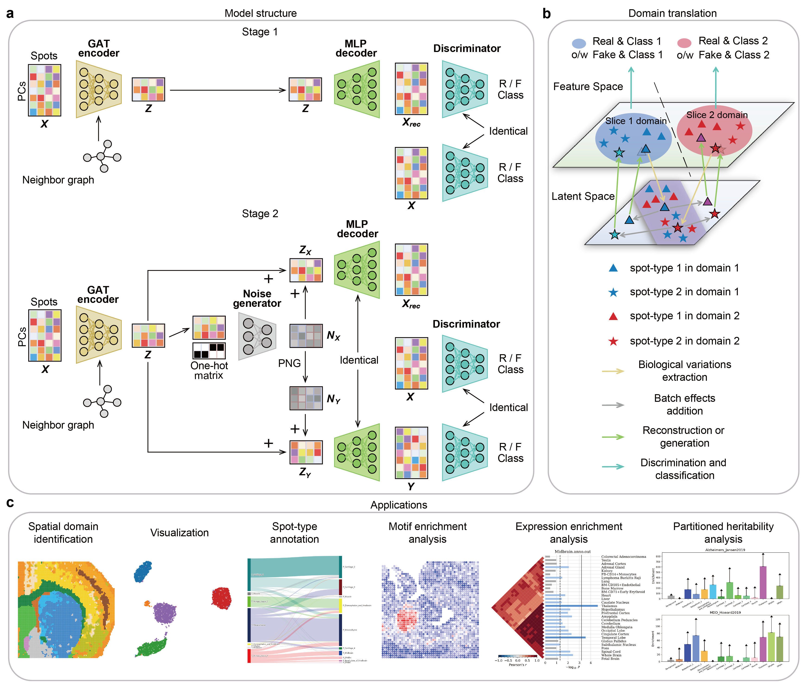

Overview
----

Recent advances in spatial epigenomic techniques have given rise to spatial assay for transposase-accessible chromatin sequencing (spATAC-seq) data, enabling the characterization of epigenomic heterogeneity and spatial information simultaneously. Integrative analysis of multiple spATAC-seq samples, for which no method has been developed, allows for effective identification and elimination of unwanted non-biological factors within the data, enabling comprehensive exploration of tissue structures and providing a more complete epigenomic landscape that facilitates the discovery of biological implications and aids in the study of regulatory processes. In this article, we present INSTINCT, a method for multi-sample INtegration of Spatial chromaTIN accessibility sequencing data via stochastiC domain Translation. INSTINCT can efficiently handle the high dimensionality of spATAC-seq data and effectively eliminate the complex noise and batch effects of samples from different conditions through a stochastic domain translation procedure. We demonstrate the superiority and robustness of INSTINCT in integrating spATAC-seq data across multiple simulated scenarios and real datasets. Additionally, we highlight the advantages of INSTINCT in spatial domain identification, visualization, spot-type annotation, and various downstream analyses, including expression enrichment analysis and partitioned heritability analysis.
